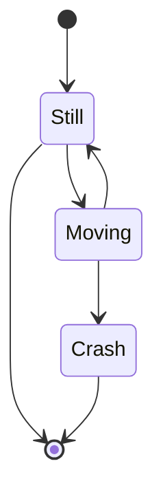

# Это заголовок для синтаксиса MD
 * [x] Изучить как устанавливается подсветка синтаксиса в редакторе Nano
 * [x] Отредактировать файл
 * [ ] Отреадактировать readme.md
 * [ ] Закомитить файл в гитхаб

HEAD -- это голова.
Коммит -- это всему голова.
Статусы файлов:
<тут пустая строка!>

<и тут пустая строка!> 

